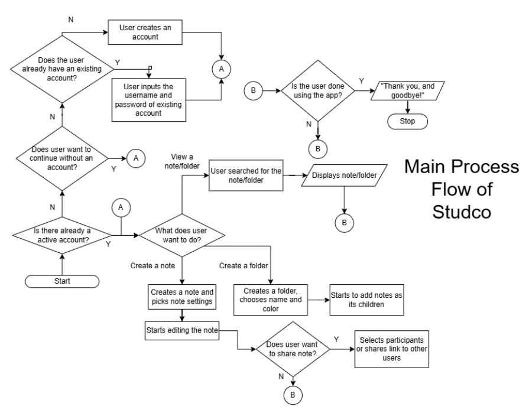

# 
Stud**co**

"Study and collaborate."

## 
Problem Statement

Students and scholars of all grades alike struggle with one thing in particular: studying. My project, aims to fix that said struggle, by creating a notes app where scholars and collaborate, view, edit, access, create, and destroy notes.

## 
Project Objectives

My program has strong objectives that clearly states its purpose.
- Addresses the study issue by making it easy to acces, online or offline, with lightweight and minimal equipment requirements and internet.
- It's very lightweight. How? When saving your note, the internet has to get the file and store it in the server. When opening a note, the server has to send the file to the client. Because the files are very low in size, it's easy to transfer them.
- Organized, with sorting of notes using folders and other tools, making it easy to find where anything is and helps the unorganized to practice their organization skills.
- Communication and transparency, making it easier to collaborate with other scholars and parties into making easy-to-use, summarized notes that even a 5 year old can comprehend.

## 
Planned Features

My projects have a lot of planned features.
1. Notes
    - Notes are created directly from the homepage on the "+" button, from there the user can pick settings on how it will look, function, and be rendered. (e.g. can be shared with others, blue background, etc.) After selecting their settings, the user can start notetaking right away.
2. Markdown Formatting
    - Using markdown formatting, you can easily make clean looking notes with easy to use functions to make your notes stand out. Also, it's very easy to implement because of the Python-Markdown. Press [this](https://python-markdown.github.io/) for more info.
3. Account Creating
    - Click "create account" on the start menu when you first open the app, choose a name and password and access shared notes. Go to settings to create account if you missed the start menu.
4. File Sharing
    - Using accounts, you can share people your file by either clicking on the settings of your note, or sharing the link to them. You can even collaborate in making notes, but due to time limitations only one of them can access at a time.
5. Blacklisting
    - The reason why you recquire an account to view, edit, and see others' notes is in the case of when you're exercising innapropriate behavior. The folder owner has the option to blacklist delinquent notetakers on the settings of their notes and folders to prevent any mishaps.
6. Folders
    - Folders are used to organize notes and ensure that it's a neat freak's best dream ever. If the time frame allows it, we can name, color, and sort folders out so that all notes are exactly where they should be in without a messy scatter.
  
## 
Planned Input & Outputs

1. Create a note, set the settings, and start notetaking. The output would be a formatted text.
2. Create account with a username and password, and store it in the server.

## 
Flowchart

Here is a flowchart with the planned flow:

 This can change at any time, it is only a raw/vague example of the process flow.
